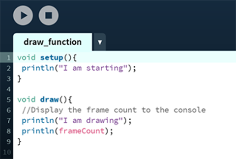

# Response

## Week 2: Responsive drawing in Processing 

Code that responds to input from the mouse, keyboard, and other devices has to run continuously. To make this happen, place the lines that update inside de **draw()** function. The code within the **draw()** block runs from top to botoom, then repeats until you quit the program. 

1. ### Example: The draw() Function

To see how **draw()** works, run this example:

You will see the following:
I'm drawing
1
I'm drawing
2
I'm drawing
3
...

2. 

3. 
    * [Jer Thorp essay: Art & the API](http://blog.blprnt.com/blog/blprnt/art-and-the-api)
    * [Is the L Train Fucked?](http://www.istheltrainfucked.com/)[and on GitHub](https://github.com/jgv/is-the-L-train-fucked

4. Break (10 minutes)

5. Make an interactive drawing (80 minutes)

6. Share work and discuss (30 minutes)

## Artists
* [Camille Utterback](http://camilleutterback.com/)
* [Facebook Flowers](http://stamen.com/work/facebook-flowers/)
* [Peter Crnokrak](http://www.petercrnokrak.com)
* [Ken Goldberg](https://boomcalifornia.com/2015/08/18/bloom/)
* [Rafael Lozano-Hemmer](http://www.lozano-hemmer.com)
* [Aaron Koblin](http://www.aaronkoblin.com/work/thesheepmarket/)
* [David Rokeby](http://www.davidrokeby.com/nchant.html)
* [Vishal K Dar and Gabriel L Dunne](https://vimeo.com/38492062)
* [Cory Arcangel "What a Misunderstanding"](http://www.what-a-misunderstanding.com/)
* [Till Nagel and Christopher Pietsch](https://uclab.fh-potsdam.de/cf/)
* [Anti Eviction Mapping Project](http://www.antievictionmap.com/)
* [Jer Thorp, Random Number Multiples](http://blog.blprnt.com/blog/blprnt/random-number-multiples)
* [Michael Zoellner](http://i.document.m05.de/2013/05/23/joy-divisions-unknown-pleasures-printed-in-3d/)
